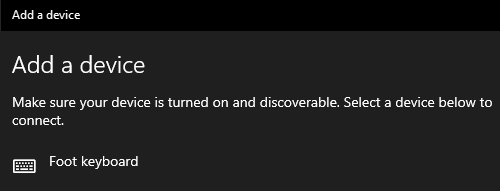

# FOOT KEYBOARD - FIRMWARE

Bộ bàn phím dùng chân điều khiển, phù hợp với các hoạt động nhập số liệu hoặc chơi game.

## Hướng dẫn kết nối

Thiết bị giao tiếp máy tính dưới dạng bàn phím bluetooth, không cần driver điều khiển.

1. Trên thiết bị **Foot Keyboard**, gạt công tắc để bật điện.\
   Lúc này, đèn led trên thiết bị sẽ nháy liên tục và rất nhanh, báo hiệu quá trình kết nối đang được diễn ra.
2. Trên máy tính, điện thoại di động, thực hiện quét các thiết bị Bluetooth xung quanh, để tìm ra thiết bị có tên **Foot Keyboard**.\
   \
    Click đúp vào tên **Foot Keyboard** để thực hiện việc kết nối (pair). 
3. Đợi một vài giây cho tới khi đèn led trên thiết bị tắt, báo hiệu quá trình kết nối đã thành công.

Bạn đã bắt đầu sử dụng được thiết bị.

## Hướng dẫn sử dụng

Lưu ý: cần [kết nối thành công với thiết bị host](#hướng-dẫn-kết-nối) trước. Từ lần thứ hai trở đi, sau khi bật nguồn, **Foot Keyboard** và thiết bị host sẽ luôn tự động kết nối lại.

1. Cắm các pedal vào các jack DC 5.5 mm. \
    Bạn có thể cắm 1, 2, hoặc tùy ý lượng pedal.
2. Đạp phím pedal, tương tự như gõ bàn phím.\
    Ở chế độ mặc định xuất xưởng, cổng pedal 01 là phím Page Down, cổng pedal 01 là phím Page Up, cổng pedal 03 là phím Enter, cổng pedal 04 là phím Ctrl+F4.

Các phím nút vặn, kết nối qua 2 socket dạng XH2.54 làm đầu chờ cho dạng nút vặn như volumn, chưa được sử dụng.

## Hướng dẫn thay đổi chức năng phím/pedal

Thiết bị **Foot Keyboard** kết nối với host qua cổng usb trên board chính. Thông qua dây cable này, thiết bị host có thể cấu hình lại vai trò của các phím pedal chức năng. Ví dụ khi bấm phím pedal 01 thì tương đương với bấm phím _Page Down_ trên bàn phím, hoặc tương đương với đoạn văn bản *Hello*, hoặc _Ctrl+Atl+Del_, hoặc bất kì..

1. Kết nối **Foot Keyboard** với máy tính bằng dây usb.
2. Trên máy tính, mở phần mềm giao tiếp Termianl/Serial/COM bất kì. Ví dụ Putty.
3. Ở phần mềm đó, chọn:
    - chọn đúng cổng COM
    - tốc độ 115200.

    Bấm **OK** để bắt đầu
4. Gõ lệnh cấu hình theo cú pháp: <span style="background:lightgreen"> **&lt;key&gt;=<USER_FORTMAT>** </span> và kết thúc bằng \n. Xem vVí dụ [các lệnh cấu hình](#các-lệnh-cấu-hình)

## Đèn báo

Trên thiết bị **Foot Keyboard**  có 3 đèn led <span style="color:blue">xanh (blue) dữ liệu</span>, <span style="color:red">đỏ (red) cấp nguồn</span>, và <span style="color:green">xanh lá (green) sạc pin</span> với ý nghĩa như sau:

- <span style="color:blue">Led xanh</span> nháy nhanh liên tục: đang dò tìm và cố gắng thiết lập kết nối bluetooth với thiết bị host.
- <span style="color:blue">Led xanh</span> tắt: không có phím nào được bấm
- <span style="color:blue">Led xanh</span> lóe sáng 0.2 giây rồi tắt ngay: có phím/pedal được bấm (không phải lượng phím được gửi tới host).
- <span style="color:blue">Led xanh</span> 2 lần chớp rồi tắt, lặp đi lặp lại trong chu kì 1 giây: đã thực hiện xong chế độ Tự kiểm tra Self Test và ngừng hoạt động. Tắt thiết bị và khởi động lại để về chế độ bình thường.
- <span style="color:red">Led đỏ</span> sáng: nguồn điện đã được cấp cho bo mạch chính.
- <span style="color:red">Led đỏ</span> tắt: bo mạch chính không được cấp điện, không hoạt động. Hhãy kiểm tra lại pin bằng cách sạc lại, hoặc tiếp điện cho thiết bị qua cổng USB.
- <span style="color:green">Led xanh lá</span> nhấp nháy: pin đang được sạc.
- <span style="color:green">Led xanh lá</span> sáng liên tục: pin đã được sạc đầy.
- <span style="color:green">Led xanh lá</span> tắt: pin không được sạc.

## Bảng mã cấu hình

### Các lệnh cấu hình

- &lt;key&gt; nhận các giá trị 01, 02, 03, 04. [Xem](#bảng-mã-phím-chức-năng)
- <USER_FORTMAT> nhận các giá trị như trong bảng sau. [Xem](#bảng-mã-kí-tự-bàn-phím)

Ví dụ:

- Chuỗi cấu hình tương đương với các phím Xin CHAO

```plain
   01=Xin {SHIFT}chao{~SHIFT} ban!
```

hoặc

```plain
   01=Xin CHAO
```

- Chuỗi cấu hình tương đương với ALT+F4 để tắt cửa sổ đang mở

```plain
   02={ALT}{F4}{~ALT}
```

- Chuỗi cấu hình tương đương với CTRL+ALT+DEL

```plain
   03={CTRL}{ALT}{DELETE}{~DELETE}{~CTRL}{~ALT}
```

- Chuỗi cấu hình xem toàn bộ thông tin cấu hình

```plain
   A?=

   Info: toc do go phim 150 key/phut.
   Info: Button 0: {459}
      length=6
   Info: Button 1: {493}
      length=6
   Info: Button 2: {634}
      length=6
   Info: Button 3: {477}{139}{~477}
      length=17
   Info: OK
```

- Chuỗi cấu hình thiết lập thời gian giữa 2 phím được gửi liên tiếp

```plain
   TK=145

   Info: thiet lap toc do go phim 145 key/phut.
```


### Bảng mã phím chức năng

Áp dụng ở phần **&lt;key&gt;** trong cú pháp cấp hình <span style="background:lightgreen"> **&lt;key&gt;**=<USER_FORTMAT> </span>. [Xem](#hướng-dẫn-thay-đổi-chức-năng-phímpedal)

| Key | Ý nghĩa |
|--|--|
|01| Phím pedal 01|
|02| Phím pedal 02|
|03| Phím pedal 03|
|04| Phím pedal 04|

### Bảng mã kí tự bàn phím

Áp dụng ở phần **<USER_FORTMAT>** trong cú pháp cấp hình <span style="background:lightgreen"> &lt;key&gt;=**<USER_FORTMAT>** </span>. [Xem](#hướng-dẫn-thay-đổi-chức-năng-phímpedal)

- Các phím đặc biệt phải được viết tên đầy đủ, chữ HOA, trong dấu ngoặc **{}**.
- Đặc biệt của đặc biệt, 3 phím chức năng CTRL, ALT, SHIFT phân biệt rõ 2 trạng thái **bấm phím** và **nhả phím**.
- Các phím bấm thường, dạng chữ cái như A, b, C điền trực tiếp.

Ví dụ:

```plain
   Xin {SHIFT}chao{~SHIFT} ban!"
```

|STT| Mã USER_FORMAT| Tương đương với phím trên bàn phím |
|--|--|--|
|1	| {~CTRL}   |nhả CTRL trái|
|2	| {~ALT}    |nhả ALT trái|
|3	| {~SHIFT}  |nhả SHIFT trái|
|4	| {~RCTRL}  |nhả CTRL trái|
|5	| {~RALT}   |nhả ALT trái|
|6	| {~RSHIFT} |nhả SHIF tráiT |
|7	| {CTRL}    |bấm CTRL trái|
|8	| {ALT}     |bấm ALT trái|
|9	| {SHIFT}   |bấm SHIFT trái |
|10	| {RCTRL}   |bấm CTRL phải|
|11	| {RALT}    |bấm ALT phải|
|12	| {RSHIFT}  |bấm SHIFT phải|
|13	| {BACKSPACE}    |BACKSPACE|
|14	| {BREAK}    |	 |
|15	| {CAPSLOCK}    |Capslock|
|16	| {DELETE}    |DELETE|
|17	| {DOWN}    |DOWN/Mũi tên xuống dưới|
|18	| {END}    |END|
|19	| {ENTER}    |Enter|
|20	| {ESC}    |ESC|
|21	| {HOME}    |HOME|
|22	| {INSERT}    |INSERT|
|23	| {LEFT}    |LEFT/Mũi tên sang trái|
|24	| {NUMLOCK}    |NumLock|
|25	| {PGDN}    |Page DOWN|
|26	| {PGUP}    |Page UP|
|27	| {PRTSC}    |Printscreen|
|28	| {RIGHT}    |RIGHT/Mũi tên sang phải|
|29	| {SCROLLLOCK}    |Scroll|
|30	| {TAB}   |TAB|
|31	| {UP}    |UP/Mũi tên lên trên|
|32	| {F1}    |F1|
|33	| {F2}    |F2|
|34	| {F3}    |F3|
35	| {F4}    |F4|
|36	| {F5}    |F5|
|37	| {F6}    |F6|
|38	| {F7}    |F7|
|39	| {F8}    |F8|
|40	| {F9}    |F9|
|41	| {F10}    |F10|
|42	| {F11}    |F11|
|43	| {F12}    |F12|
|44	| {F13}    |F13|
|45	| {F14}    |F14|
|46	| {F15}    |F15|
|47	| {F16}    |F16|
|48	| {BS}    |BACKSPACE |
|49	| {DEL}    |DELETE |
|50	| {INS}    |INSERT |
|51	| {{}      |{|
|52	| {}}      |}|

## Kiêm tra Self Test

Để vào chế độ Self Test, hãy thực hiện các bước đúng trình tự:

1. Trên máy tính, mở phần mềm soạn thảo bất kì. Đặt con trò bàn phím vào ô soạn thảo.
1. Tắt điện thiết bị **Foot Keyboard**.
1. Bấm phím **pedal 01** và giữ nguyên trạng thái bấm. Lưu ý KHÔNG bấm nút BOOT.
1. Bật công tắc để khởi động.
1. Bấm nút BOOT. Giữ cho tới khi hết đèn led xanh nháy (báo hiệu đang thực hiện kết nối bluetooth)
1. Quan sát nội dung hiển thị trên phần mềm soạn thảo, hiển thị giống với video dưới đây.

<video controls src="assets/FKB_SelfTest.mp4" title="Self Test"></video>

Khi mới khởi động, tiếp điện, bấm và giữ nút BOOT và phím PEDAL 01 trong khoảng 2 giây để đưa mạch về trạng thái kiểm tra hoạt động Self_Test. Xem trạng thái [đèn led báo](#đèn-báo).
Đồng thời hãy mở giao tiếp Serial (tốc độ 115200, 8bit, 0stop) và xem các thông tin chi tiết trên đó.

## Khôi phục cấu hình xuất xưởng

Cấu hình xuát xưởng như sau:

- Tên mạng Bluetooth BLE: Foot Keyboard
- Chức năng Pedal 01: Page Down
- Chức năng Pedal 02: Page Up
- Chức năng Pedal 03: Enter
- Chức năng Pedal 04: Ctrl+F4

Để khôi phục cấu hình xuất xưởng, hãy

1. Tắt điện thiết bị **Foot Keyboard**.
1. Bấm phím **pedal 02** và giữ nguyên trạng thái bấm. Lưu ý KHÔNG bấm nút BOOT.
1. Bật công tắc để khởi động.
1. Bấm nút BOOT. Giữ cho tới khi đèn led xanh nháy 3 lần và tắt, lặp đi đi lặp
   Đã xong.

## Xem thêm

- [Hardware](../hardware/README.md)
- [Webconfig](../webconfig/README.md)
